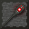

<div align="center">
    
    <h1 align="center">The Wabbajack</h1>
    <i>"And as for you, my little mortal minion... feel free to keep the Wabbajack. As a symbol of my... Oh, just take the damn thing." -Sheorogath, Daedric Prince of Madness</i>
</div>

# API

## Adding Spells

**Wabbajack** includes a simple API that lets you easily add your own spells to the mod:

`build.gradle(.kts)`
```groovy
repositories {
    maven {
        url = uri("https://maven.meteordev.org/releases")
    }
}

dependencies {
    modImplementation("io.github.racoondog:wabbajack:1.0.0")
}
```

`MyCustomSpell.java`
```java
import io.github.racoondog.wabbajack.api.WabbajackApi;
import io.github.racoondog.wabbajack.api.spell.WabbajackSpell;
import io.github.racoondog.wabbajack.impl.WabbajackProjectileEntity;
import net.minecraft.entity.LivingEntity;
import net.minecraft.particle.ParticleEffect;
import net.minecraft.particle.ParticleTypes;
import net.minecraft.server.world.ServerWorld;
import net.minecraft.util.hit.HitResult;
import org.jetbrains.annotations.Nullable;

public class MyCustomSpell extends AbstractEntityAoESpell {
    public static void registerSpell() { // Call this from within your mod's initializer method
        WabbajackApi.registerSpell(new MyCustomSpell());
    }
    
    @Override
    public ParticleEffect getParticleEffect() {
        return ParticleTypes.MYCELIUM;
    }
    
    @Override
    public boolean onEntityEffect(ServerWorld world, WabbajackProjectileEntity projectile, HitResult collision, LivingEntity target, @Nullable LivingEntity caster) {
        // This method is called for every entity within the spell's area of effect
        
        target.kill(world);
        return true;
    }
}
```

## Extending affected mobs

By default, **The Wabbajack!** does not affect modded entities, players, bosses, and miscellaneous entities. This is done
using data tags, so you can easily add to the list of affected entities from a data pack or your own mods.

Simply create a `data/wabbajack/tags/entity_type/can_be_wabbajacked.json` file, and add the following content replacing
`my_mod:my_custom_entity` with the id of the entity you wish to add to the list:

```json
{
    "replace": false,
    "values": [
        "my_mod:my_custom_entity"
    ]
}
```

The same can be done with `data/wabbajack/tags/attribute/can_scramble.json` to add entity attribute types to the list of
those affected by the Attribute Scramble spell.